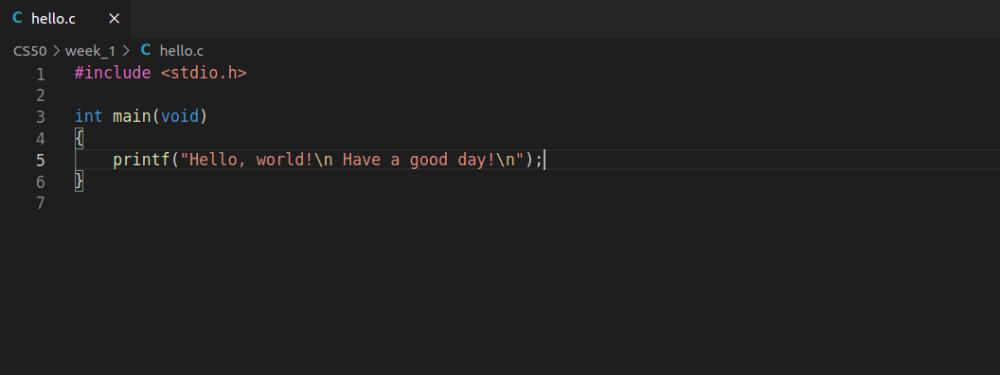

# Algorithms and Data Structures

### Familiarize myself with the C language's syntax (pointers, structs, memory allocation) while completing around 349 algorithms problems in order to understand and learn the basics of programming. 

***

#### Basics:

* Variables, Expressions, Statements, Data Types 
* Operators, Operator Precedence, Logical Operators
* Logic and Control Flow Statements, Loops
* Working with Arrays, Strings 
* Functions
* Working with text files 
* Pointers, Structs 

#### Algorithms and Data Structures:

* Lists, stack data structure, queue data structure, graphs, tree data structure
* Sorting algorithms
* Search algorithms 
* Algorithmic Efficiency
* Techniques and algorithms for problem solving:
    * Divide and Conquer technique
    * Recursion technique
    * Dynamic programming 
    * Greedy algorithms

***  

#### How it started :

